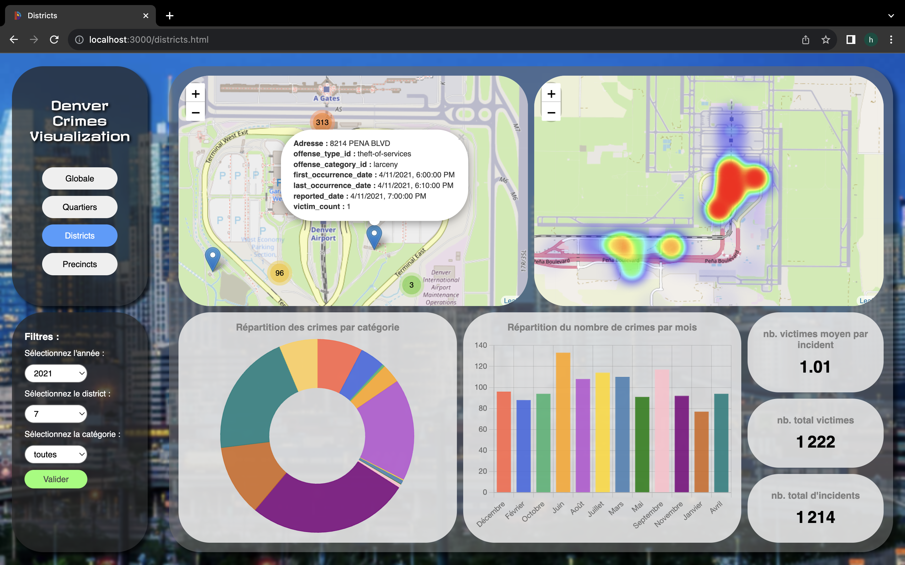
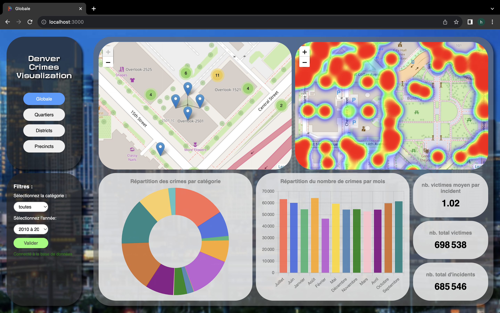
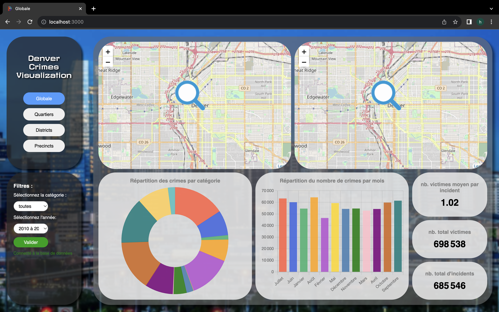
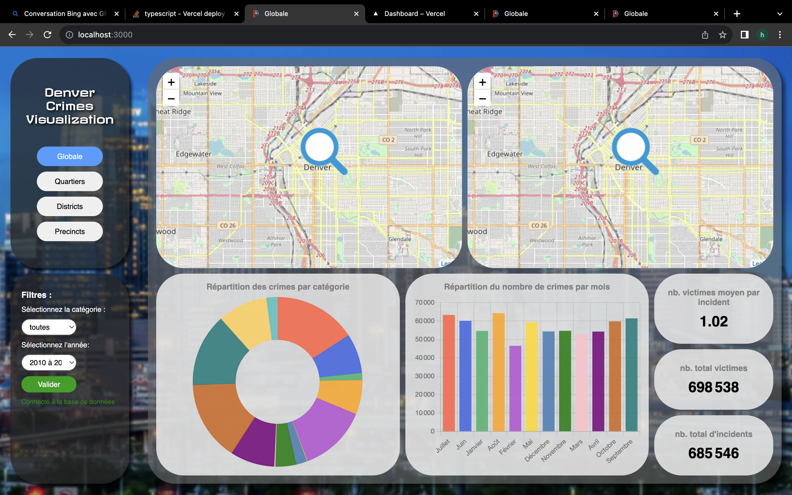
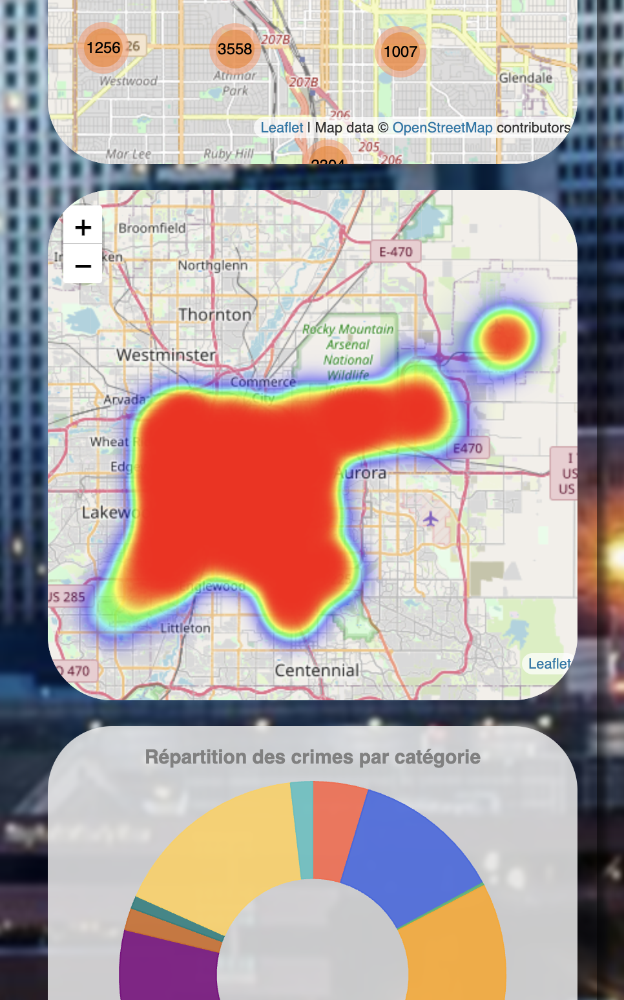
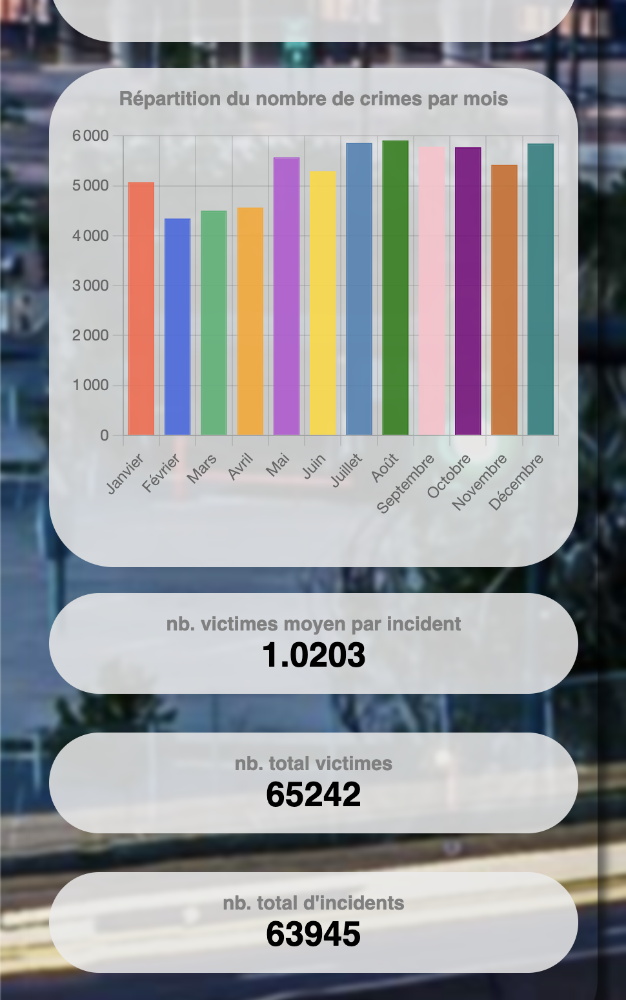

# Denver Crimes Visualization

Attention le live demo ne fonctione pas correctement : utiliser seulement les onglets Quartiers, Districts et Precincts et les années 2010, 2011, 2012 car il y a des limites sur vercel, les grosses requêtes ne fonctionnent pas, et lent. 
live demo : https://denver-crimes.vercel.app/index.html

les fichiers .sql sont dans /data_files/ pour créer la base de données 

